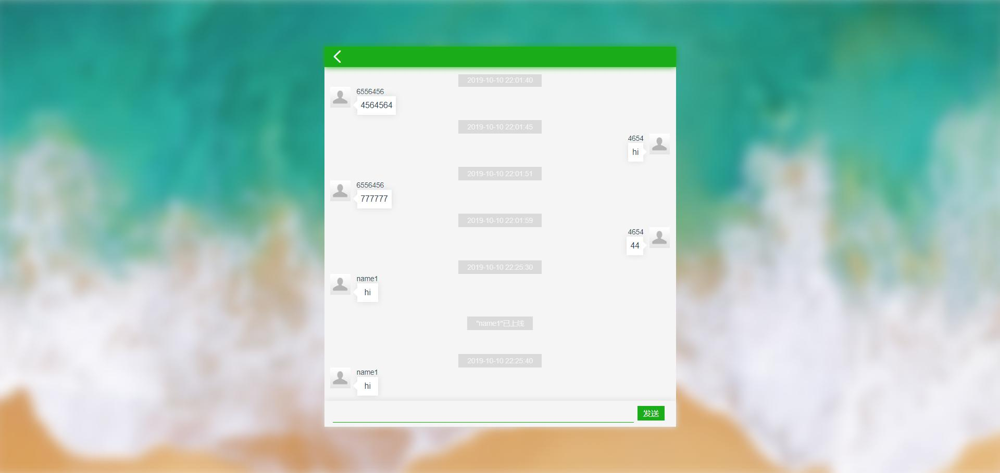

# chatroom

> A Vue.js project

###socket.io + vue.js 实现简易的聊天室
	
## 分别在project和project-other目录下,在命令窗口运行npm install 和 npm run dev



###技术栈：
1.  sass:css预处理器，利于后期的维护.
	如:如果要更改整体的主题颜色，只需要改变src/style/attributes.scss下的$themeColor就行了
2.	vuex:通过vuex来实现各组件之间数据的传递
	通过 this.$store.state.属性名 获取存储到state中的数据
	通过 this.$store.commit(‘mutations里的方法名’, 传参) 调用mutations中到方法，进而改变state中的数据
	不过在这种简单的场景下，可以使用vue中的bus总线
3.	localStorage:长期储存-->聊天记录
	vuex 的数据是存储在浏览器维护的内存中，页面刷新会重新初始化
	localStorage 的数据是存储在浏览器维护的一个简单数据库里面，在本地文件中存储，所以可以“持久化”存在。
4.	express模块
5.	socket.io:[https://socket.io/] Socket.io是一个WebSocket库。通过其提供的接口，可以实现实时通信

> 其他：
1. 使用postcss-plugin-px2rem插件把px转成rem
2. 使用@media screen实现网页布局响应式
	
	
	
```
//服务端 >build>webpack.dev.conf.js:

const app = require('express')();					//app是Express初始化的一个函数处理器，可以将其提供给一个HTTP服务器
const server = require('http').createServer(app);	//创建服务器
const io = require('socket.io')(server);			//传递了一个http(HTTP Server)对象来创建一个新的socket.io实例
server.listen(8083)

let oSockets = [];
io.sockets.on('connection', socket => {	//io就是io.sockets到简写
  console.log('用户链接成功')
  oSockets.push(socket)

  //socket.io 使用on(eventname,callback)监听消息
  //监听客户端发送的 send_event 事件
  //群聊
  socket.on('send_event', data => {
	socket.broadcast.emit('callBackMsg', data);	//使用 emit 发送消息，broadcast 表示 除自己以外的所有已连接的socket客户端。
	console.log(data)
  })

  // 上线
  socket.on('online', data => {
	socket.broadcast.emit('online', data);
		console.log('data:',data)
  })

  // 断开连接
  socket.on('disconnect', () => {
	oSockets.filter(item => item !== socket);	//筛选，把数组中不是socket的去掉
	console.log('用户离线')
  })
})
	```
	

```
//客户端
	methods: {
		...
			sendMsg() {		//点击发送信息时触发send_event事件
				if (this.inputValue !== '') {
					//socket.io 使用 emit(eventname,data) 发送数据,eventname可以是自己命名的事件
					//给服务端发送 send_event事件名的消息及其数据
					socket.emit('send_event', {
						from: 'other', //传给服务器，对于从服务器拿到这个数据到人来说，我们是'别人'，消息要在左边
						value: this.inputValue,
						date: this.getTime(),
						name: this.name,
						src: this.ico_header
					});
					this.messages.push({
						from: 'self',
						value: this.inputValue,
						date: this.getTime(),
						name: this.name,
						src: this.ico_header
					})
					this.inputValue = ''
				}
			},
			...
		}

	mounted() { //挂载
		socket.on('callBackMsg', data => { //监听callBackMsg事件，接收从服务器分发的数据
			this.messages.push(data);
		})
		socket.emit('online', this.name)
		socket.on('online', name => {
			if (!name) {
				console.log('没有name')
				return
			}
			this.messages.push({
				onlineName: `"${name}"已上线`
			})
		})
		console.log('messages:', this.messages)
	},
```
	


## Build Setup

``` bash
# install dependencies
npm install

# serve with hot reload at localhost:8080
npm run dev

# build for production with minification
npm run build

# build for production and view the bundle analyzer report
npm run build --report
```

For a detailed explanation on how things work, check out the [guide](http://vuejs-templates.github.io/webpack/) and [docs for vue-loader](http://vuejs.github.io/vue-loader).

## 回车进入群聊